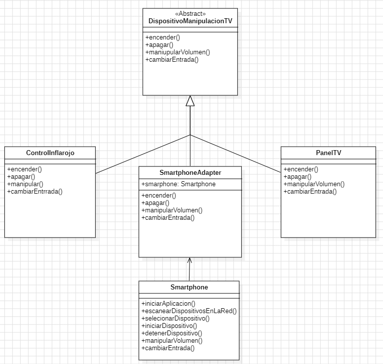

# Patrones: Solucion de la Problematica

En la Solucion al problema de herencia de metodos a una clase la cual trabaja de manera distinta.
Se utilizo el patron de diseño **Adapter** por el cual use una clase que recibiria los metodos por herencia de la clase prinicipal y intanciaria los metodos de la clase **Smartphone** para asi poder adaptar la funcionalidad sin tener que renombrar metodos.

